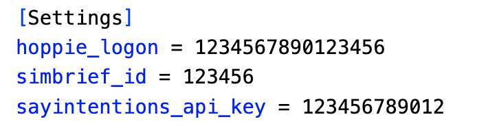

# **ACARS Bridge**

The ACARS bridge enables aircraft to communicate with Sayintentions.AI's ACARS network even though there is no direct method of communications.

This is achieved by bridging between Hoppie's ACARS network and Sayintentions.AI's ACARS network; a unique 4 character ATSU Callsign is created for the client aircraft to use when sending PDC, Telex and CPDLC messages to the Sayintentions.AI's ACARS network via Hoppie's network.

Users send CPLDC and/or PDC messages to this callsign from their aircraft, when signed onto the Hoppie's ACARS network. The bridge polls the Sayintentions.AI's ACARS network using the aircraft's callsign from your latest SimBrief plan.

## Configuration

The following information is required

* Your Hoppie Logon ([Register](https://www.hoppie.nl/acars/system/register.html "Register for Hoppie"))
* Your SayIntentions API Key (from the [Pilot Portal](https://portal.sayintentions.ai/portal/account/ "pilot portal"))
* Your SimBrief Pilot ID (from [your account)](https://dispatch.simbrief.com/account "SB ccount")

## Operation

The bridge will then listen on both networks and forward messages between them.

## Maintenance

A configuration file (bridge.ini) is created in the same directory as the programme; this contains the configuration information.

### Buy me a Coffee

